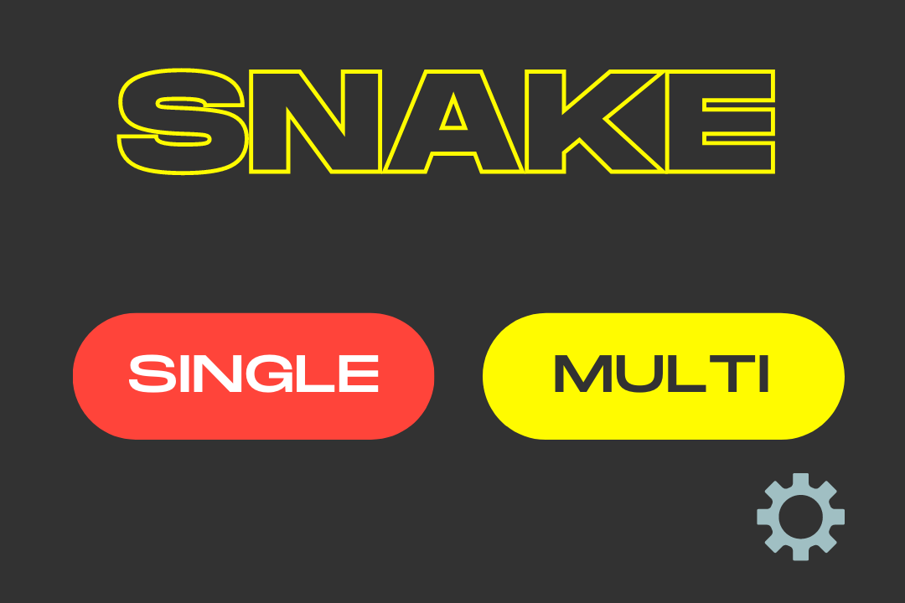
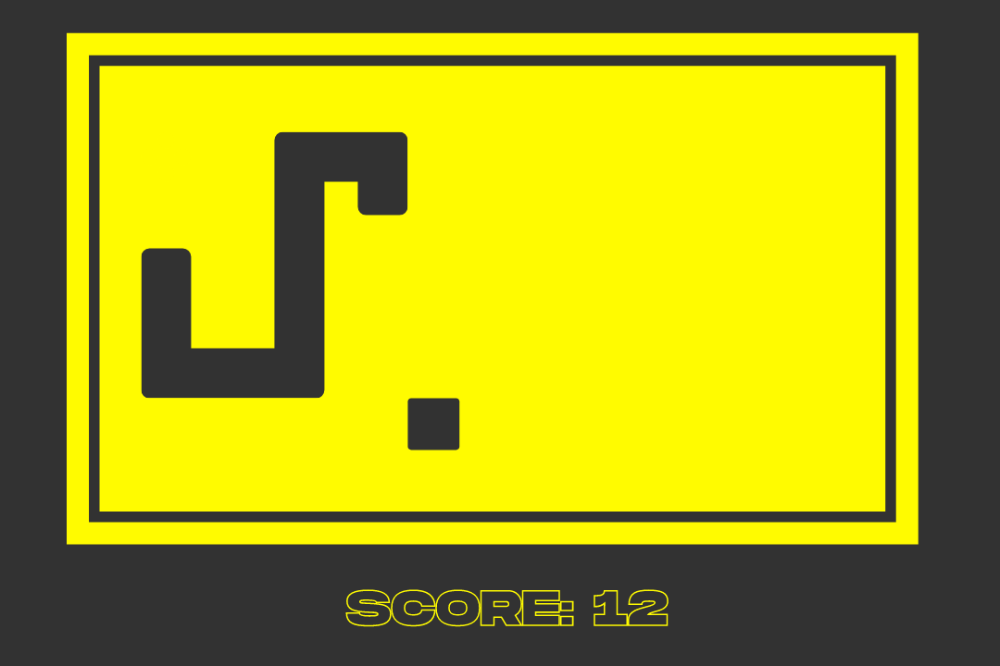
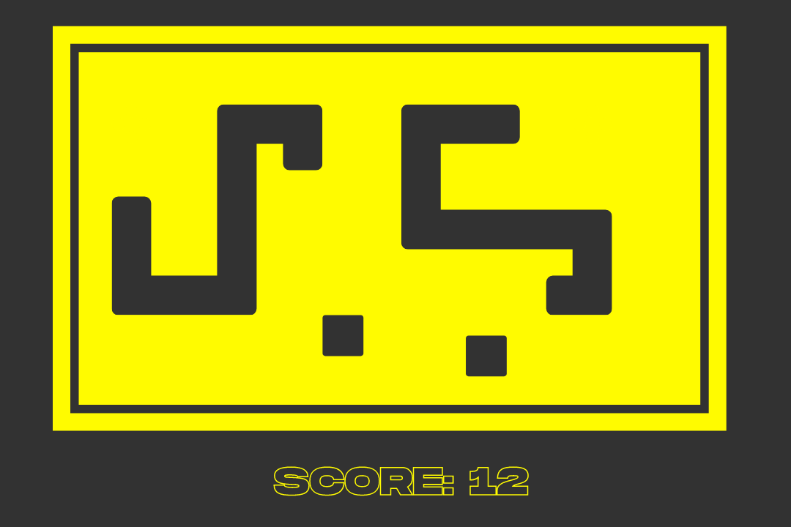
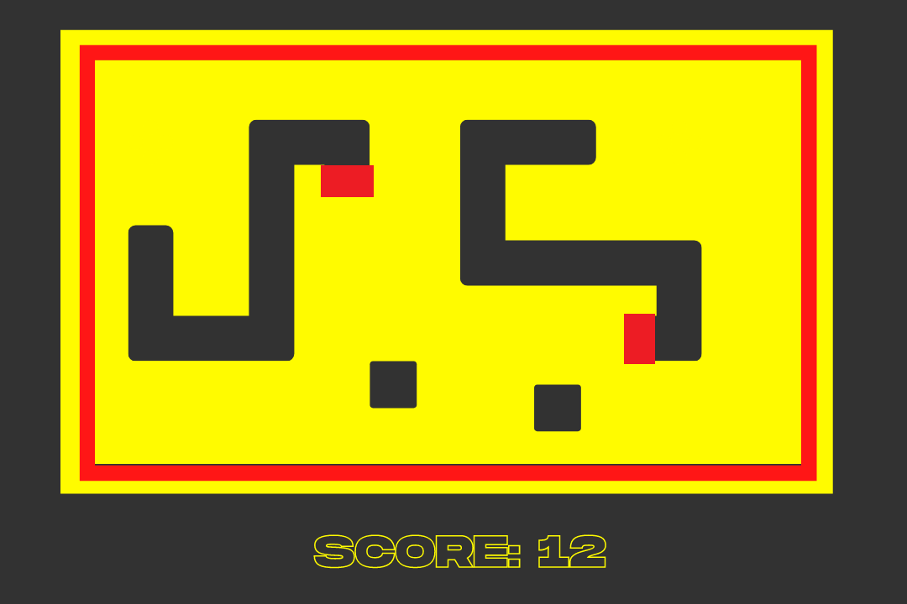
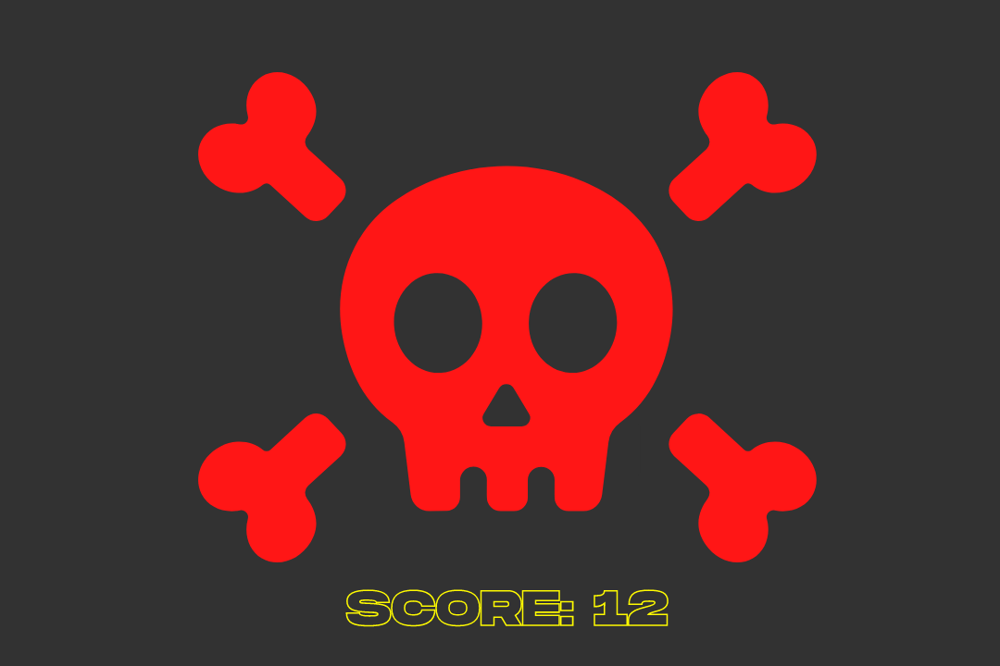
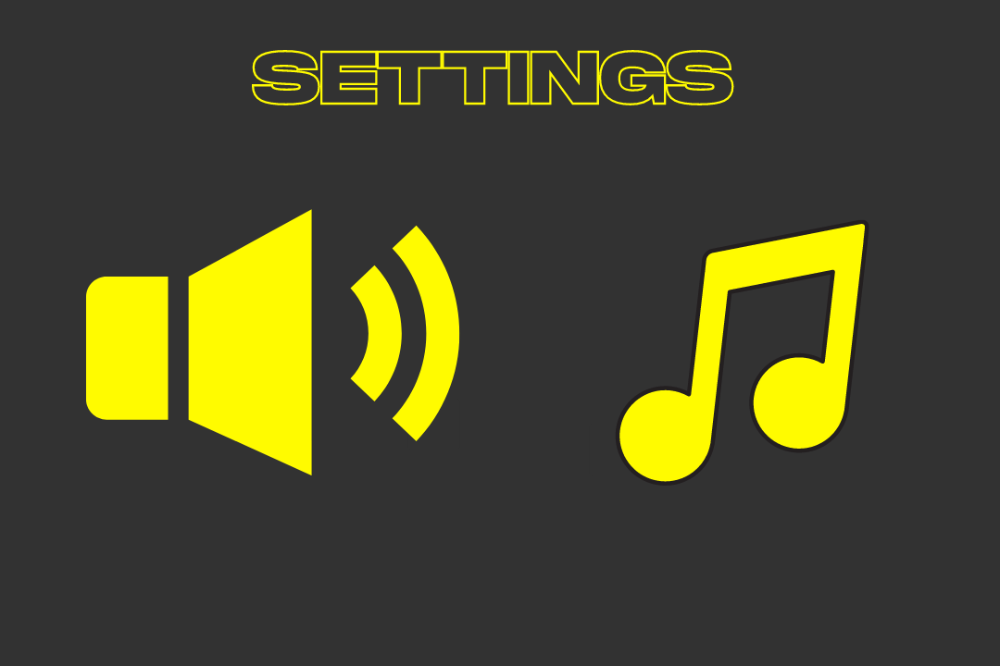
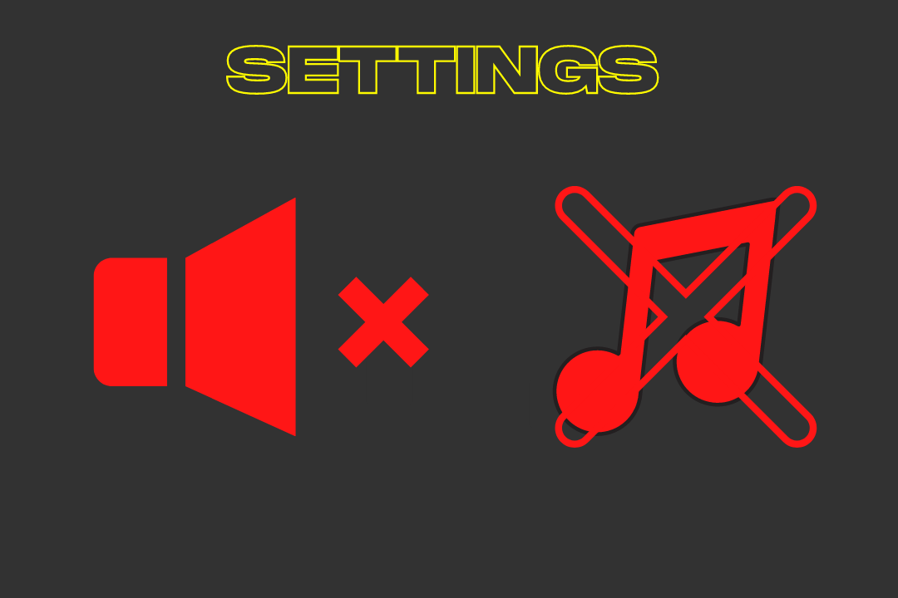

# Hra Snake

Predmet Základy tvorby interaktívnych aplikácií

## Podstata hry

Hrac je snake. Pohybuje sa po canvase hore, dole, doprava a dolava. Snazi sa zjest jedlo. Po kazdom zjedeni jedla sa jeho dlzka zvacsi a zvacsi sa skore. Hra sa konci ked sa hlava hada dotkne akejkolvek inej casti hada. 

Pri multiplayerovi hraci hraju spolu. Vedia sa zabit aj sami seba aj navzajom. 

## Ciel hry

Cielom hry je ziskat najvacsie skore pomocou zjedenia co najvacsieho mnozstva jedla. Rovnako to plati aj pri multiplayerovi.

## Herne mody:
- singleplayer
- multiplayer (dvaja hraci spolu)

## Ovladanie: 
- sipky
- aswd 

Pri singleplayer moznost obidvoch.
Pri multiplayer jeden hrac aswd a druhy sipky.

## Obrazovky
- uvodna stranka (play single / multi, setting)
- settings (hudba, zvuk, atd)
- canvas singleplayer
- canvas multiplayer
- leaderboard

## Level
1. Easy - prechodne steny
2. Medium - neprechodne steny, rychlejsie
3. Hard - neprechodne steny, rychlejsie, jed

## Objekty
- had
- jedlo
- jed
- steny

## Herne prostredie

Herne prostredie bude raster stvorcoveho (singleplayer) a obdlznikoveho (multiplayer)
Snake bude postupnost stvorcov v rastri herneho prostredia
Jedlo / Jed bude stvorec (z hladiska logiky) v rastri herneho prostredia 

## Obrazovky

